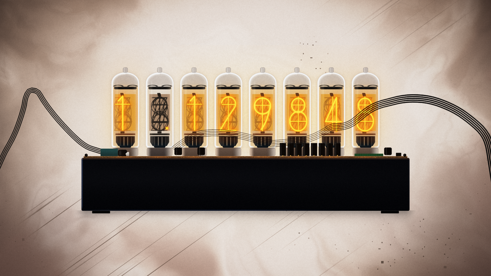

# worldline-transition

照着《STEINS;GATE》的世界线变动做的一段转场动画，大概 10 秒，网页里跑。本来是给 [AMADEUS](https://github.com/meditecnic/AMADEUS) 做的跃迁演出，还没接进去，先单独放出来。



画面全是代码现画的，没用原作的视频、截图或音频。粉丝作品，和官方没关系。

> 有快切、闪白和画面撕裂，对闪光敏感的话请勾「减少动态效果」，或者别看。

## 直接看（什么都不用装）

1. 下载 [worldline-transition.html](https://github.com/meditecnic/worldline-transition/releases/latest/download/worldline-transition.html)（约 1.8 MB）
2. 双击打开，Chrome、Edge 都行
3. 点「开始播放」

不用联网。可以选 SG → β 或 β → SG，也可以模拟成功、偏慢、失败三种结果（都是假的，没接后端）。空格暂停，Esc 回到开头。

打开是黑屏或者特别卡的话，多半是浏览器没开硬件加速，换个浏览器或者在设置里打开「使用图形加速」试试。

## 想改代码

装好 [Node.js](https://nodejs.org/)（20 以上）之后：

```bash
npm install
npm run dev            # 打开 http://127.0.0.1:5179/ ，改代码页面会自动刷新
npm run build:single   # 重新打成单个 html，在 dist-single/ 里
```

## 许可

代码 MIT。字体是 Noto Sans SC 和 IBM Plex Mono，OFL 许可，见 `public/fonts/OFL.txt`。《STEINS;GATE》相关权利归 MAGES. Inc. 等权利人。
